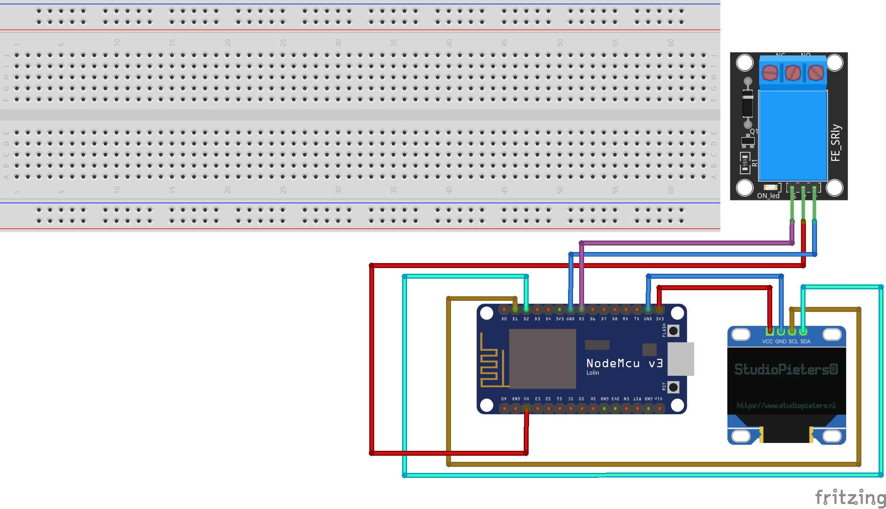

# BDSM Trainer - Device - Relay device with OLED v1
The device has a universal function and can therefore be used for many things.

For example as a cheap remote controlled Tens device. You disconnect one of the cables in the middle and connect it to the relay. As soon as the relay picks up, the current flows.

You can also use it to switch on devices for different devices, like a Magic Wand or a spanking machine. 

To indicate that the device is ready, it shows a symbol on the oled display. As soon as it goes into active mode, a text is displayed.

# Required components

* ESP8266 (required for WLAN)
* 128 x 64 OLED display 0,96"
* Relay module (Recommended: 3.3v version)

# Stripboard

# Status
The device works excellent and stable

# Disclaimer
All devices listed here are for study purposes only. Please do not use them on living creatures. I take no responsibility if anything happens. And always remember, safety and health comes first.
